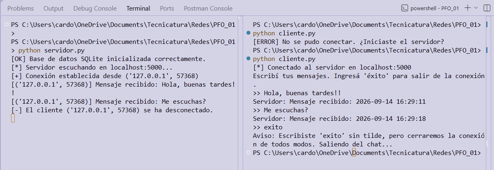
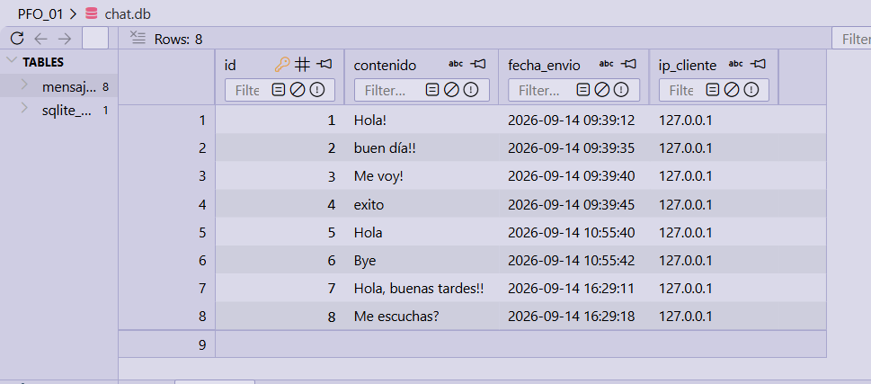
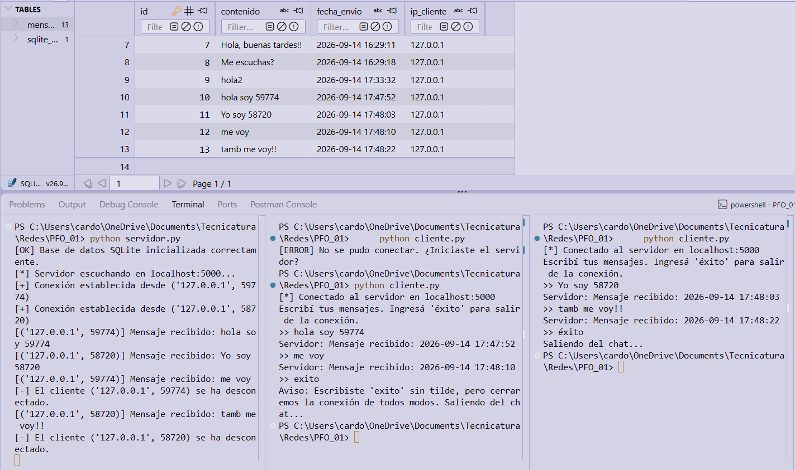

# Propuesta Formativa Obligatoria
## TP: Implementación de un Chat Básico Cliente-Servidor con Sockets y Base de Datos

Este proyecto tiene como objetivo configurar un servidor de sockets en Python que reciba mensajes de clientes, los almacene en una base de datos y envíe confirmaciones. El código fue desarrollado aplicando buenas prácticas de modularización y manejo de errores, y se utilizaron los comentarios para explicar las configuraciones en el servidor.

---

### Características del Sistema

**Servidor (`servidor.py`)**
* Se creó un socket que escuche en `localhost:5000`.
* Se usaron funciones separadas para:
  * Inicializar el socket.
  * Aceptar conexiones y recibir mensajes.
  * Guardar cada mensaje en una DB SQLite con los campos: `contenido`, `fecha_envio`, `ip_cliente`.
  * Manejar errores (puerto ocupado, DB no accesible)].
* Usando `threading` se generan hilos independientes por cada cliente conectado, permitiendo la comunicación simultánea con el servidor sin bloquear todo.
* El servidor responde al cliente con: `"Mensaje recibido: <timestamp>"`.

**Cliente (`cliente.py`)**
* Tiene la capacidad de conectarse al servidor y enviar múltiples mensajes hasta que el usuario escriba éxito.
* Muestra la respuesta del servidor para cada mensaje.

**Base de Datos (`base_datos.py`)**
* Se usó el módulo `sqlite3` para la base de datos.

### Instrucciones de Ejecución

Para probar el funcionamiento de este proyecto, ejecutá pruebas locales (primero servidor, luego cliente en otra terminal):

1. En tu primera terminal, iniciá el servidor: `python servidor.py`
2. En una segunda terminal, iniciá el cliente: `python cliente.py`

### Demostración funcionamiento

> A continuación, se observa la comunicación en consola tras enviar múltiples mensajes y finalizar al escribir la palabra de salida:

> Verificación de la persistencia de datos almacenados en SQLite:

> Múltiples clientes que se comunican con el servidor:

---
